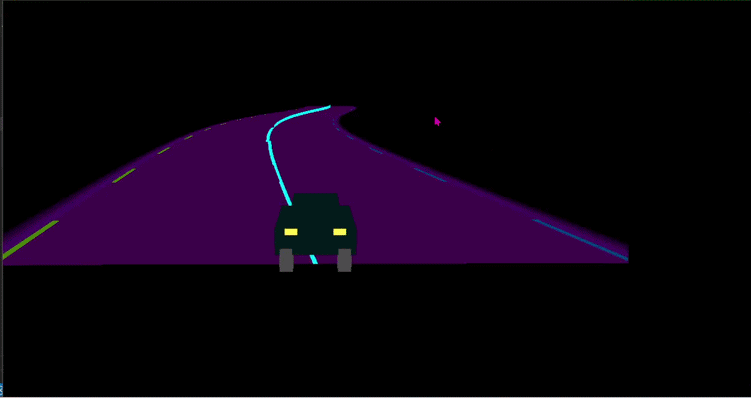

# 🎮 Computer Graphics Gamebox

A small collection of Python + OpenGL games and experiments built for my Computer Graphics course.

---

## 🕹️ Games Included

| Game | Description |
|---|---|
| 💎 Diamond Catcher | A simple catching game where the player collects falling diamonds |
| ⚔️ Fighting with Enemy | A mini action game with enemy interaction |
| 🚀 Infinite Neon Track Game | A futuristic neon-style endless runner |
| 🧩 Two Interesting Tasks | Small graphics experiments and tasks |

---

## 🎮 Controls

| Key | Action |
|-----|--------|
| ⬅️ Left Arrow | Move Left |
| ➡️ Right Arrow | Move Right |
| ESC | Exit Game |

### 🛠️ Tech Used
- Python  
- OpenGL  
- GLUT  

### ▶️ How to Run

```bash
pip install PyOpenGL PyOpenGL_accelerate
python "INFINITE NEON TRACK GAME.py"
---

## 🎥 Gameplay Preview


